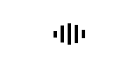

# rbx-ui
A collection of various UI components built using [Roact](https://github.com/Roblox/Roact). Currently:

## Components
### Spinners

#### Bars

## TODO

- [ ] Documentation
- [ ] Add more items to TODO
